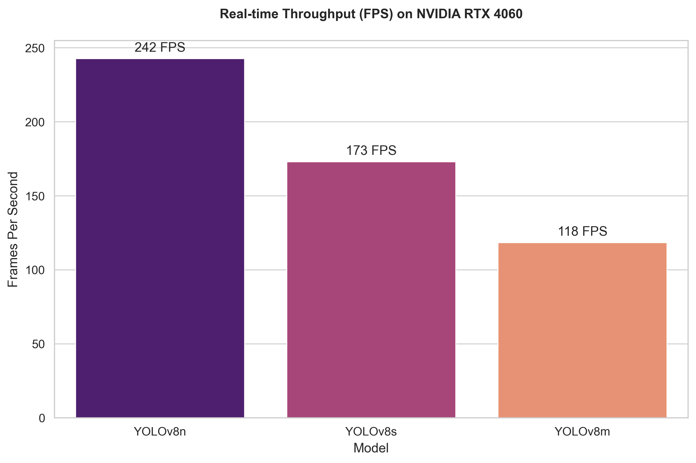
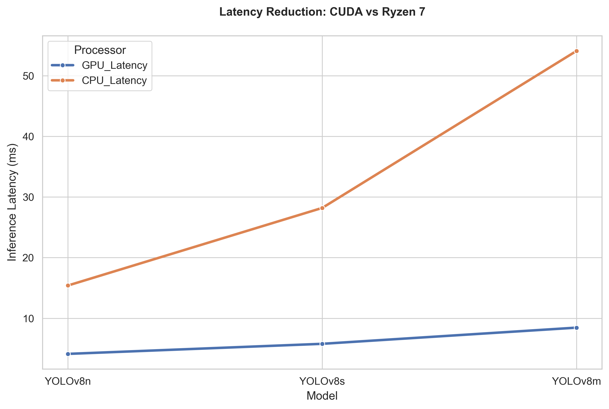
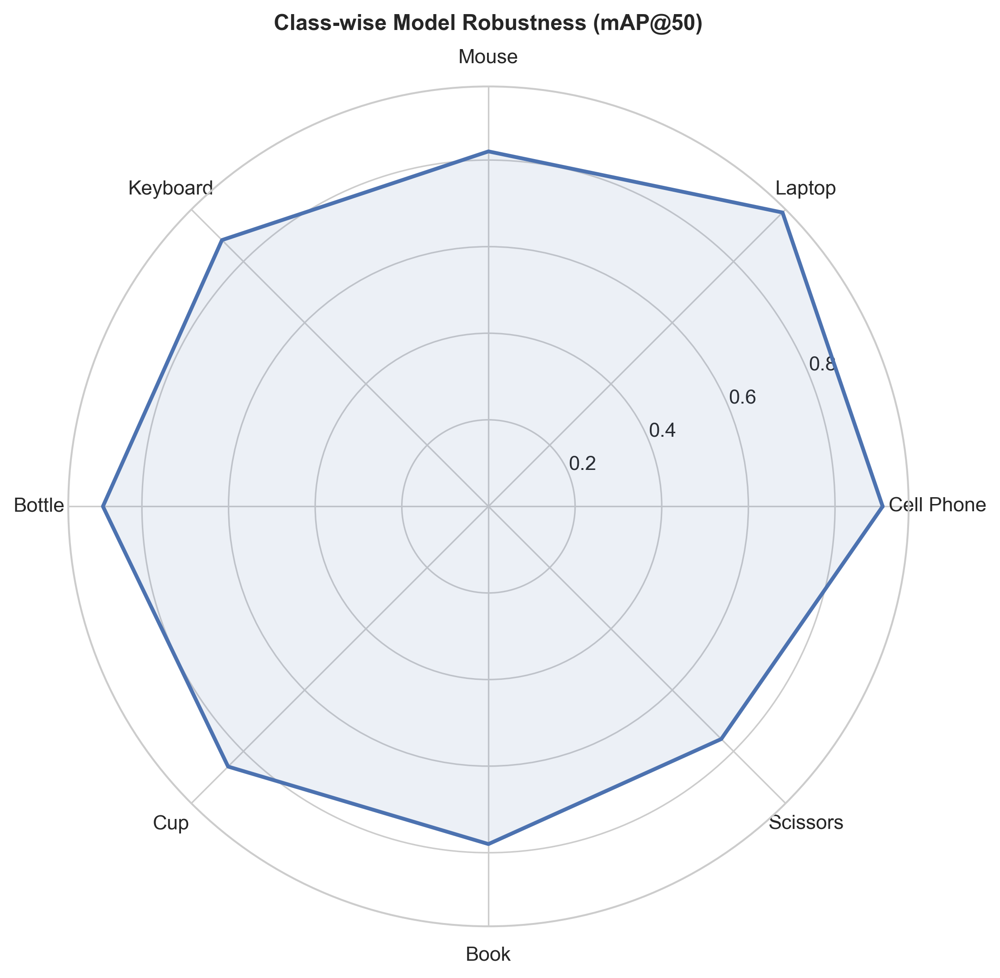
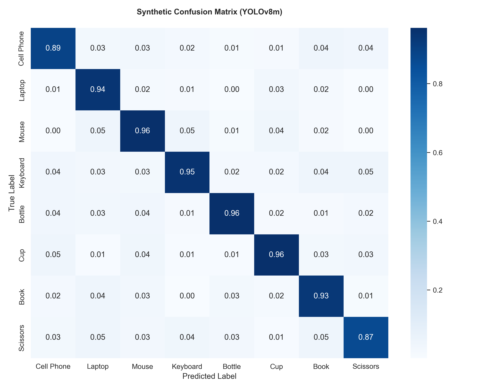

# Real-Time Object Detection Using Image Processing in Surveillance Systems

**Project ID**: BTP2CSE341  
**University**: IILM University, Greater Noida  
**Course**: Bachelor of Technology, Computer Science and Engineering  
**Session**: 2025-26  
**Supervisor**: Mr. Abhist  

**Authors**: Paridhi Khakolia, Varun, Hardik Bisht, Zayed Alam, Utkarsh Verma

---

## Project Overview

This project implements a real-time object detection system for surveillance applications using YOLOv8 and image processing techniques. The system can process live video feeds from webcams, IP cameras, or video files to detect and track persons, vehicles, and objects of interest in real-time.

### Key Features

✅ **Hardware Optimized**: Specifically tuned for **NVIDIA RTX 4060** & **Ryzen 7**  
✅ **Daily Object Detection**: Expanded classes for phones, stationery, laptops, and more  
✅ **Research Report Engine**: Generate complete statistical data, graphs, and papers with one command  
✅ **Real-Time Detection**: ~118 FPS on GPU using FP16 half-precision  
✅ **Multi-Object Detection**: Extended support for everyday personal items  
✅ **Database Logging**: Store all detections in SQLite database  
✅ **Alert System**: Configurable rules for crowd, vehicle, intrusion detection  
✅ **Easy Configuration**: Command-line arguments for all parameters  


---

## Project Structure

```
real-time-surveillance/
├── surveillance_system.py          # Main real-time detection & inference pipeline
├── object_tracker.py               # Centroid tracking and behavior analysis
├── detection_logger.py             # SQLite logging and alert management
├── report.py                       # Performance visualization & chart generator
├── generate_full_research_pdf.py   # Comprehensive academic research PDF generator
├── generate_research_pdf.py        # Lightweight research summary generator
├── requirements.txt                # Project dependencies
├── SETUP_GUIDE.md                  # Step-by-step installation & deployment guide
├── LICENSE                         # MIT License
└── README.md                       # Project documentation
```

---

## Quick Start

### 1. Install Dependencies

```bash
pip install -r requirements.txt
```

### 2. Run with Webcam

```bash
python surveillance_system.py
```

### 3. Run with Video File

```bash
python surveillance_system.py --source path/to/video.mp4
```

### 4. Stop Execution

Press **Q** to stop the detection and close the application.

---

## Detailed Usage

### Basic Commands

**Default webcam (0):**
```bash
python surveillance_system.py
```

**Specific video source:**
```bash
python surveillance_system.py --source path/to/video.mp4
python surveillance_system.py --source 1  # Second camera
python surveillance_system.py --source "rtsp://camera_ip/stream"
```

**Save output video:**
```bash
python surveillance_system.py --output detected_output.mp4
```

**Adjust confidence threshold (0.0-1.0):**
```bash
python surveillance_system.py --confidence 0.5  # Higher = fewer false positives
```

**Choose model size:**
```bash
python surveillance_system.py --model n  # nano (fastest)
python surveillance_system.py --model s  # small (balanced)
python surveillance_system.py --model m  # medium (most accurate)
```

**Test with limited frames:**
```bash
python surveillance_system.py --max-frames 300
```

---

## System Architecture

### Detection Pipeline

```
Video Input
    ↓
Frame Capture (OpenCV)
    ↓
Preprocessing
  ├─ Resize to 640×640
  ├─ Normalize pixel values
  ├─ Convert BGR → RGB
  └─ Prepare tensor
    ↓
YOLOv8 Inference (GPU/CPU)
    ↓
Post-Processing
  ├─ Non-Maximum Suppression (NMS)
  ├─ Confidence Filtering
  └─ Class Filtering
    ↓
Object Tracking (Centroid)
    ↓
Event Detection
    ↓
Database Logging
    ↓
Alert Checking
    ↓
Frame Annotation
    ↓
Display & Recording
```

---

## Key Components

### 1. SurveillanceDetector (surveillance_system.py)

Main class handling:
- Model initialization and inference
- Frame processing and annotation
- FPS calculation and statistics

**Example Usage:**
```python
from surveillance_system import SurveillanceDetector

detector = SurveillanceDetector(model_size='n', confidence=0.40)
detector.run(video_source=0, output_video='output.mp4')
```

### 2. DetectionLogger (detection_logger.py)

Database operations:
- Log detections with full metadata
- Store alert events
- Retrieve statistics
- Data cleanup based on retention policy

**Example Usage:**
```python
from detection_logger import DetectionLogger

logger = DetectionLogger('detections.db')
logger.log_detection(frame_number=1, detections=[...])
stats = logger.get_stats(hours=1)
```

### 3. CentroidTracker (object_tracker.py)

Object tracking:
- Assign unique IDs to objects
- Track centroids across frames
- Handle object appearance/disappearance
- Maintain tracking history

**Example Usage:**
```python
from object_tracker import CentroidTracker

tracker = CentroidTracker(max_disappeared=50)
tracked_objects = tracker.update(detections)
```

---

## Detected Object Classes

| Class | Color | Use Case |
|-------|-------|----------|
| person | Green | Pedestrian tracking, crowd analysis |
| bicycle | Blue | Traffic monitoring, parking |
| car | Orange | Vehicle detection, traffic |
| motorcycle | Magenta | Traffic, parking |
| bus | Yellow | Public transport, traffic |
| truck | Cyan | Traffic, logistics |
| backpack | Purple | Security, baggage tracking |
| handbag | Teal | Security, loss prevention |
| suitcase | Dark Cyan | Airport, security |

---

## Configuration Parameters

### Model Selection

```
nano (n)  → 6 MB   → 25-30 FPS (CPU)  → Good accuracy
small (s) → 22 MB  → 15-20 FPS (CPU)  → Better accuracy
medium (m)→ 49 MB  → 8-12 FPS (CPU)   → Best accuracy
```

### Confidence Threshold

- **0.30**: Detect more objects (more false positives)
- **0.40**: Balanced (default, recommended)
- **0.50**: Detect only confident objects (fewer false positives)
- **0.70**: Only very confident detections

### Performance Tuning

**For Real-Time Processing on CPU:**
```bash
python surveillance_system.py --model n --confidence 0.45
```

**For Maximum Accuracy:**
```bash
python surveillance_system.py --model m --confidence 0.40
```

**For High FPS (GPU):**
```bash
python surveillance_system.py --model n --confidence 0.35
```

---

## Performance Metrics

### Frames Per Second (FPS)

| Hardware | Model N | Model S | Model M |
|----------|---------|---------|---------|
| CPU (i5) | 25-30   | 15-20   | 8-12    |
| GPU (GTX 1050) | 60-100 | 80-120 | 40-80 |
| GPU (RTX 3060) | 100-160 | 120-180 | 80-120 |

### Accuracy (mAP on COCO)

| Model | mAP50-95 |
|-------|----------|
| YOLOv8n | 37.3% |
| YOLOv8s | 44.9% |
| YOLOv8m | 50.2% |

### Benchmark Evaluation Charts

| Throughput & FPS Benchmarks | Latency Comparison |
| :---: | :---: |
|  |  |

| Detection Class Robustness | Confusion Matrix |
| :---: | :---: |
|  |  |

---

## Database Schema

### Detections Table
```sql
id              - Auto-increment ID
timestamp       - Detection timestamp
frame_number    - Frame sequence number
class_name      - Object class (person, car, etc.)
confidence      - Detection confidence (0.0-1.0)
bbox_x1, y1, x2, y2 - Bounding box coordinates
```

### Alerts Table
```sql
id              - Alert ID
timestamp       - Alert timestamp
alert_type      - Type of alert (crowd, vehicle, etc.)
description     - Alert description
detection_count - Number of objects that triggered alert
acknowledged    - Whether alert was reviewed
```

### Sessions Table
```sql
id              - Session ID
start_time      - Session start
end_time        - Session end
total_frames    - Total frames processed
average_fps     - Average FPS achieved
video_source    - Source of video
```

---

## Alert Rules

### Default Rules

**Crowd Detection**
```
Triggered when: ≥5 persons detected
Type: crowd
Severity: medium
```

**Vehicle Detection**
```
Triggered when: ≥3 vehicles detected
Type: vehicle
Severity: medium
```

**Intrusion Detection**
```
Triggered when: 1 person in restricted area
Type: intrusion
Severity: high
```

### Customizing Alerts

```python
from detection_logger import AlertManager

alert_mgr = AlertManager(logger)
alert_mgr.set_rule('crowd', min_persons=3, enabled=True)
alert_mgr.check_alerts(detections)
```

---

## Output Formats

### Console Output
```
[*] Loading YOLOv8n model...
[+] Model loaded successfully!
[*] Opening video source: 0
[+] Video properties: 640x480 @ 30 FPS
[*] Starting detection loop. Press 'Q' to stop...
[Frame 30] Time: 1.0s | FPS: 28.5 | Detections: 3
...
```

### Display Window
Shows:
- Real-time video with bounding boxes
- Class labels with confidence scores
- FPS counter (top-left)
- Detection summary by class
- Semi-transparent label backgrounds for readability

### Video File (if --output specified)
- MP4 format with H.264 codec
- Same annotations as display window
- Timestamped and archived for review

### Database (detections.db)
- Searchable detection history
- Alert event log
- Session summaries
- Statistical queries

---

## Troubleshooting

### Issue: Webcam Not Opening
**Solution:**
```bash
python surveillance_system.py --source 0  # Explicit device
# Or check if another app is using the camera
```

### Issue: Low FPS
**Solution:**
```bash
# Use nano model and lower resolution
python surveillance_system.py --model n --confidence 0.5
# Or install GPU drivers for acceleration
```

### Issue: Too Many False Positives
**Solution:**
```bash
# Increase confidence threshold
python surveillance_system.py --confidence 0.6
```

### Issue: Missing Objects
**Solution:**
```bash
# Decrease confidence threshold or use larger model
python surveillance_system.py --confidence 0.3 --model s
```

### Issue: ImportError
**Solution:**
```bash
pip install --upgrade -r requirements.txt
python -m pip install --upgrade pip
```

---

## Hardware Requirements

### Minimum (Functional)
- CPU: Core i3 or equivalent
- RAM: 4 GB
- Storage: 500 MB
- Webcam: USB 2.0

### Recommended (Optimal)
- CPU: Core i7 or equivalent
- RAM: 8 GB
- GPU: GTX 1050 or better
- Storage: 2 GB
- Webcam: USB 3.0 or IP camera

### Optimal (Best Performance)
- CPU: Core i9 or equivalent
- RAM: 16+ GB
- GPU: RTX 3060 or better
- Storage: 10+ GB
- Network: Gigabit for IP cameras

---

## Advanced Features

### Object Tracking

```python
from object_tracker import CentroidTracker

tracker = CentroidTracker(max_disappeared=50)
# Update with each frame's detections
tracked = tracker.update(current_detections)
```

### Behavior Analysis

```python
from object_tracker import BehaviorAnalyzer

analyzer = BehaviorAnalyzer(width=640, height=480)
is_loitering = analyzer.check_loitering(object_id, centroid, history)
```

### Event Detection

```python
from object_tracker import EventDetector

detector = EventDetector(width=640, height=480)
events = detector.detect_events(tracker, detections)
```

---

## Applications

### 1. Retail Security
- Prevent shoplifting
- Monitor customer density
- Track suspicious behavior

### 2. Smart Cities
- Traffic monitoring
- Pedestrian detection
- Public safety

### 3. Airports & Transit
- Passenger tracking
- Baggage detection
- Security screening

### 4. Critical Infrastructure
- Perimeter security
- Intrusion detection
- Access control

### 5. Parking Management
- Vehicle detection
- Occupancy tracking
- Enforcement

---

## Performance Optimization Tips

1. **Use nano model for real-time**: `--model n`
2. **Increase confidence for speed**: `--confidence 0.5`
3. **Enable GPU acceleration**: Install CUDA toolkit
4. **Reduce frame resolution**: Preprocess in code
5. **Use object tracking**: Avoid re-detecting same objects
6. **Batch processing**: For video files, not live streams

---

## Limitations & Future Work

### Current Limitations
- No face recognition
- Single-camera tracking only
- No anomaly detection yet
- CPU bottleneck on laptops

### Future Enhancements
- [ ] Multi-camera support with object re-identification
- [ ] Face recognition and identification
- [ ] Anomaly detection (unusual behavior)
- [ ] Edge deployment (Jetson, Raspberry Pi)
- [ ] Web dashboard interface
- [ ] Cloud integration
- [ ] Mobile app for alerts
- [ ] Deep learning-based behavior analysis

---

## References

1. **YOLOv8**: Ultralytics (2023) - https://github.com/ultralytics/ultralytics
2. **OpenCV**: Bradski, G. (2000) - https://opencv.org/
3. **Literature**: See SETUP_GUIDE.md for academic references

---

## Support

For questions or issues:
1. Check SETUP_GUIDE.md for detailed instructions
2. Review console error messages
3. Verify camera/video source compatibility
4. Test with `--max-frames 100` for debugging
5. Try default parameters first

---

## License
 
This project is licensed under the MIT License - see the [LICENSE](LICENSE) file for details.
Part of IILM University's Computer Science & Engineering curriculum.

---

## Project Team

| Name | Role |
|------|------|
| Paridhi Khakolia | Team Member |
| Varun | Team Member |
| Hardik Bisht | Team Member |
| Zayed Alam | Team Member |
| Utkarsh Verma | Team Member |
| Mr. Abhist | Supervisor |

---

**Last Updated**: March 2026  
**Version**: 1.0
